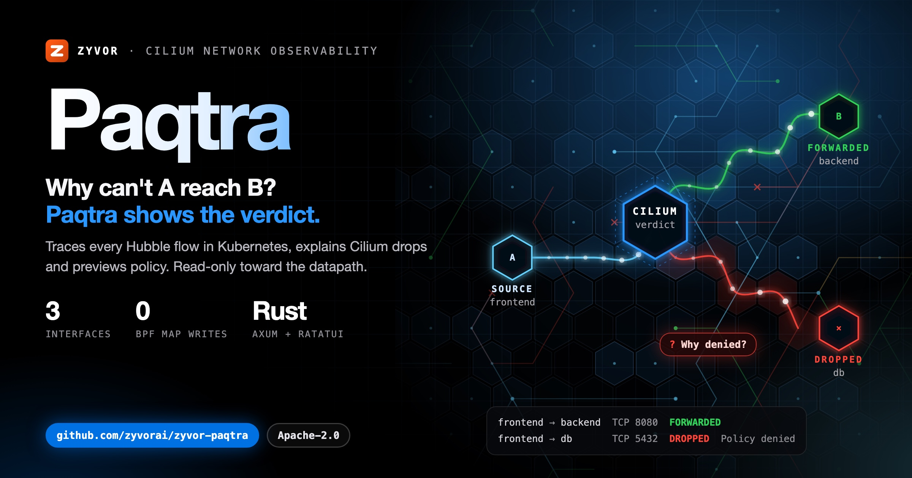
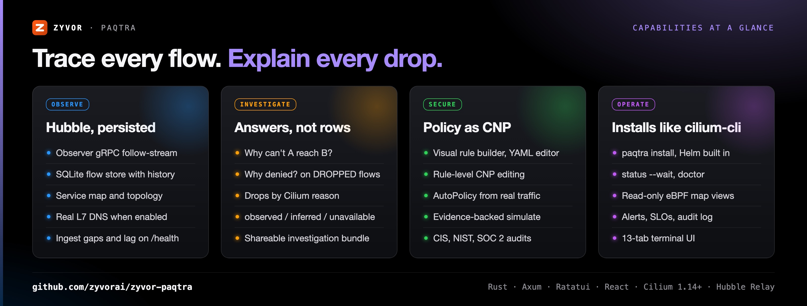
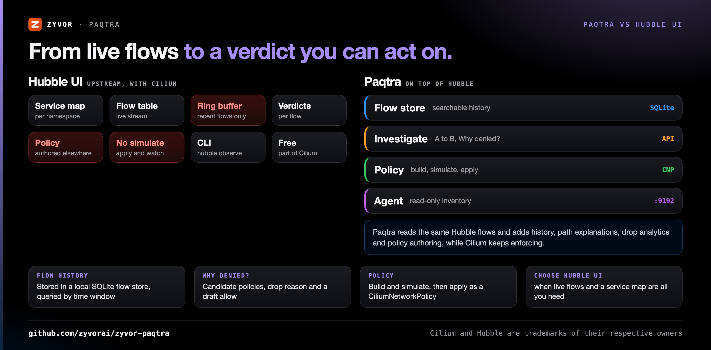
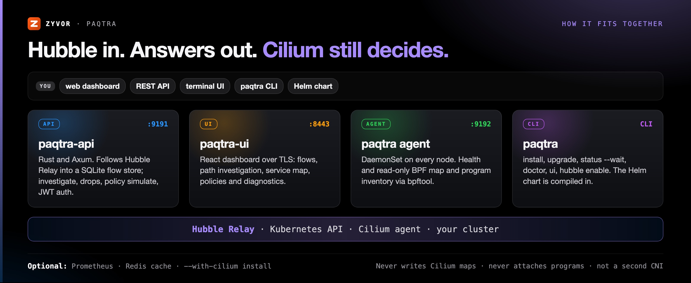

<div align="center">

# Paqtra

[](https://github.com/zyvorai/zyvor-paqtra/actions/workflows/ci.yml)
[](LICENSE)
[](Cargo.toml)
[](https://cilium.io/)
[](CHANGELOG.md)
[](https://zyvorai.github.io/zyvor-paqtra/)

[](https://zyvor.dev/schedule?utm_source=github&utm_medium=paqtra&utm_campaign=readme_hero)
[](https://zyvor.dev/poc?utm_source=github&utm_medium=paqtra&utm_campaign=readme_hero)
[](#quickstart)



### Why can't A reach B? Paqtra traces every flow and shows Cilium's verdict.

**Cilium-native network observability and operations for Kubernetes.** Every Hubble flow stored and searchable, drops explained by Cilium reason, `CiliumNetworkPolicy` changes simulated before you apply them, and enforcement left with Cilium.

**Web dashboard** · **REST API** · **Terminal TUI** · **Why denied? on any flow** · **Read-only toward the datapath** · **Free, Apache 2.0**

📖 **[Read the full docs](https://zyvorai.github.io/zyvor-paqtra/)**: quickstart, architecture, the Cilium boundary, and a product tour.

</div>

---

## What's new

| | |
|---|---|
| **Per-second metrics platform** (Unreleased) | Every agent streams host, network, disk, pod, process-group and app metrics each second; the API keeps them in 1 s / 1 min / 1 h tiers, adds Hubble flow, verdict, drop, HTTP and DNS series, flags anomalies per dimension, runs 45 built-in metric alerts and exports to Prometheus remote write, OTLP or Graphite. [docs/metrics.md](docs/metrics.md) |
| **Installs like `cilium-cli`** (2.2.0) | The Helm chart is compiled into the `paqtra` binary: `install`, `upgrade`, `status --wait`, `--with-cilium`, prerequisite checks, `doctor`. |
| **Signed releases** (2.2.0) | Static musl Linux and macOS binaries with `sha256sums.txt`, a cosign keyless signature, an SBOM and a Homebrew formula. |
| **Rule-level policy editing** (2.2.0) | Add, replace or delete one rule of a `CiliumNetworkPolicy`, with `?dry_run=true`, conflict detection and audit entries. |
| **Cilium Insights** (2.2.0) | Read-only views of Cilium features, Hubble nodes, BGP, LB-IPAM, L2, pod IP pools, CIDR groups and Gateway API resources. |
| **Change impact and shareable investigations** (2.2.0) | Before/after flow correlation for a change, and investigation bundles with a time-limited, redacted share link. |
| **Why denied?** (2.1.0) | From any dropped flow: identities, candidate CNP/CCNP, the drop reason and a draft allow. |
| **Large flow stores stay fast** (2.2.1, 2.2.2) | Reads never block ingest, every read has a deadline, and recent-window queries go through the time index. |

Full history: [CHANGELOG.md](CHANGELOG.md).

---

## Why Paqtra

| When this happens… | Paqtra gives you… |
|---|---|
| A request fails and nobody knows why | Path explain and **Why denied?** on any flow, with confidence-tagged evidence |
| Cilium drops packets and the reason is buried | Drop analytics by Cilium reason, plus a per-packet explanation |
| You want to change policy without breaking things | Simulate a `CiliumNetworkPolicy` against indexed flows before you apply it |
| The flow you need scrolled out of Hubble minutes ago | A continuous Hubble follow-stream into a local SQLite flow store, queried by time window |
| Network tooling that touches the datapath is a non-starter | Read-only toward Cilium: no BPF map writes, no program attach, not a second CNI |
| Every Cilium add-on needs its own install story | `paqtra install` with the Helm chart built in, `paqtra status --wait`, `paqtra doctor` |

Paqtra is observe-first. Flows come from Hubble; node-local enrichment may read the BPF map inventory. **Enforcement stays with Cilium**: policy changes go through `CiliumNetworkPolicy` (CNP), never through Paqtra's own datapath.



---

## Paqtra vs Hubble UI



Paqtra does not replace Hubble; it reads Hubble's flows through Hubble Relay and builds on them.

| | **Paqtra** | **Hubble UI** (ships with Cilium) |
|---|---|---|
| Flow source | Hubble Observer gRPC follow-stream | Hubble Relay |
| Flow history | Local SQLite flow store, queried by time window | Live flows from Hubble's in-memory buffers |
| Service map | Service map and observed-traffic topology | Service map per namespace |
| "Why can't A reach B?" | Path explain with observed / inferred / unavailable evidence | Inspect the flows yourself |
| Drops | Drop analytics by Cilium reason, Why denied? per flow | Verdict and drop reason on each flow |
| Policy | Rule builder, YAML editor, AutoPolicy, simulate, apply as CNP | Not a policy editor |
| Interfaces | Web dashboard, REST API, terminal UI, CLI | Web UI (plus the `hubble` CLI) |
| **Choose Hubble UI when** | | Live flows and a service map are all you need and you want only what ships with Cilium |

---

## See it live


Captured against a live lab cluster with Cilium and Hubble. Full tour on the [docs site gallery](https://zyvorai.github.io/zyvor-paqtra/gallery/).


### Observe

Live Hubble flows with verdict coloring and WebSocket streaming, a service map and an observed-traffic topology built from real flows. Real L7 DNS query/rcode/latency when Cilium DNS visibility is on; L4-only never invents SERVFAIL. [Capabilities →](docs/capabilities.md)

Per-second node metrics next to the flows: CPU, memory, disks, interfaces, TCP, conntrack, pod cgroups, process groups (by `comm` only) and annotated apps (nginx, Redis, Envoy, CoreDNS, etcd, any Prometheus endpoint), with live canvas charts, per-dimension anomaly detection, "what changed here?" correlation and Netdata-style metric alerts that notify but never apply policy. `paqtra metrics …` covers the same from the terminal. [Metrics →](docs/metrics.md) · [Alerts →](docs/metric-alerts.md) · [Anomalies →](docs/anomaly-detection.md) · [Apps →](docs/app-collectors.md)


### Investigate

Ask "why can't A reach B?" and get an answer with **observed**, **inferred** or **unavailable** evidence labels. Click **Why denied?** on any dropped flow. [Investigate →](docs/investigate.md) · [Root cause →](docs/rootcause.md)


The dashboard also includes real kernel eBPF data views powered by `bpftool`: conntrack tables, policy maps, IP cache, LB maps and drop analytics. All read-only. [eBPF integration →](docs/ebpf-integration.md)


### Secure

A visual rule builder, a YAML editor, ML-powered **AutoPolicy** and an evidence-backed simulator, all applied as `CiliumNetworkPolicy` through the Kubernetes API. Cilium enforces. [AutoPolicy →](docs/autopolicy.md) · [Simulator →](docs/simulator.md)


Also included: compliance audits (CIS, NIST, SOC 2), anomaly detection, chaos engineering, canary deployments and multi-cluster views. [Everything Paqtra does →](docs/capabilities.md)

---

## How it fits together



| Component | Port | Role |
|---|---|---|
| API (`ghcr.io/zyvorai/paqtra-api`) | `9191` | Rust + Axum REST API: Hubble ingest into the flow store, investigate, drops, policy, JWT auth |
| UI (`ghcr.io/zyvorai/paqtra-ui`) | `8443` | React dashboard, served over TLS by default |
| Node agent (`ghcr.io/zyvorai/paqtra`) | `9192` | DaemonSet on every node: health and read-only map and program inventory |
| `paqtra` CLI | — | Install, upgrade, status, doctor, `ui`, `hubble enable`; the Helm chart is built in |

Ports are the Helm chart defaults in [chart/values.yaml](chart/values.yaml). Architecture in depth: [docs/architecture.md](docs/architecture.md) · [docs/web-architecture.md](docs/web-architecture.md).

### What Paqtra never does


Hard boundaries, enforced by review and repeated in [AGENTS.md](AGENTS.md):

- Never writes Cilium BPF maps or pins over `cil_*` programs.
- Never attaches, detaches or replaces Cilium (or Netra) programs. Attachment inventory is **read-only** classification (`cil_*` / `netra_*` / other).
- The agent observes, reports health and inventories. Policy apply goes through Cilium CRDs.
- Does not collect application payloads, argv/cmdline, or Secret contents.
- Does not introduce a second CNI or compete with Cilium's datapath.
- Prefers Hubble for flows; uses maps for node-local enrichment only.

Details: [docs/cilium-brotherhood.md](docs/cilium-brotherhood.md) and [docs/ebpf-integration.md](docs/ebpf-integration.md).

---

## Quickstart

Prerequisites: a Kubernetes cluster and a kube-context. Cilium with Hubble Relay is required too; `paqtra install --with-cilium` sets it up if it is missing.

```bash
# Install the CLI (downloads, verifies and installs the latest release)
curl -fsSL https://raw.githubusercontent.com/zyvorai/paqtra/main/install.sh | sh   # or: brew install zyvorai/tap/paqtra

# Install Paqtra into the current kube-context (the Helm chart is built in)
paqtra install            # add --with-cilium if the cluster has no Cilium yet
paqtra status --wait
paqtra ui                 # open the console

# Something wrong?
paqtra doctor
```

Build from source, Docker, Helm, environment variables and testing: **[Install guide](docs/install.md)** · CLI reference: [docs/cli.md](docs/cli.md).

---

## Paqtra vs PacketWolf


Paqtra is the free, Apache-2.0 community edition. **PacketWolf** is Zyvor's commercial platform on the same Cilium-native foundation, for teams that need to go from *seeing* the network to *securing and operating* it.

| | **Paqtra** (Apache 2.0) | **PacketWolf** (commercial) |
|---|---|---|
| Flows, verdicts, service map, drops, root cause | ✅ | ✅ |
| AutoPolicy, simulator, healer, chaos, canary, replay, multi-cluster | ✅ | ✅ |
| Which **process** opened each socket (kernel attribution, syscall tracing, `netpred explain`) | — | ✅ |
| Custom eBPF probes with honest attach status | — (read-only by design) | ✅ opt-in |
| **Threat detection**: learned baselines, DGA and beaconing, attack graph, GeoThreat, Tetragon correlation | — | ✅ |
| **Containment**: six profiles, gated auto-response with rollback, forensic pack | — | ✅ |
| Zero-Trust Pilot, policy insight scorecard, blast radius, drift scan, KubePosture | — | ✅ |
| **Ask Zyra** network copilot (58 read-only tools, gated write actions) | — | ✅ |
| Compliance Lens (SOC 2, PCI-DSS, HIPAA), CVE posture, cost-aware egress, risk forecast | Basic audits (CIS, NIST, SOC 2) | ✅ |
| Kubernetes operator and CRDs, `netpred` CLI | — | ✅ |
| OIDC, SAML, LDAP sign-in, tenant views, SIEM export | JWT | ✅ |
| KubeVirt VM console and VNC, in-browser shell, podman/docker visibility | — | ✅ |
| Support | Community | ZyvorAI Labs |

Full breakdown: [docs/paqtra-vs-packetwolf.md](docs/paqtra-vs-packetwolf.md). For a demo, a trial or pricing, book a [demo](https://zyvor.dev/schedule?utm_source=github&utm_medium=paqtra&utm_campaign=readme_footer), start a [30-day PoC](https://zyvor.dev/poc?utm_source=github&utm_medium=paqtra&utm_campaign=readme_footer) or contact [sales@zyvor.dev](mailto:sales@zyvor.dev) or visit [zyvor.dev](https://zyvor.dev/?utm_source=github&utm_medium=paqtra&utm_campaign=readme_footer).

## Paqtra or Netra?

**Netra** is the independent eBPF sibling: its own programs and maps under `/sys/fs/bpf/netra`, with leased emergency control. The two must not fight.

| Choose **Paqtra** when… | Choose **Netra** when… |
| --- | --- |
| Cilium is already the CNI of record | You need CNI-independent observe on cgroup v2 alone |
| You want Hubble flows, path investigation and policy preview in one place | You want a leased emergency deny with automatic return to observe |
| Policy changes should stay in Cilium CNPs | You need kernel drop attribution and packet capture without a CNI |

Who owns what: [Suite placement](docs/suite-placement.md) · [Cilium boundaries](docs/cilium-brotherhood.md).

## Security

JWT authentication (HS256, 32+ char secret) with no default credentials, RBAC-ready middleware, input validation on all kubectl-bound fields, an explicit CORS origin allowlist, rate limiting and confirmation dialogs on destructive operations.

Report vulnerabilities through [SECURITY.md](SECURITY.md). Deeper reading: [docs/client/security-whitepaper.html](docs/client/security-whitepaper.html).

## Documentation map

| I want to… | Read |
|---|---|
| See everything Paqtra does | [Capabilities and stack](docs/capabilities.md) · [Features](docs/features.md) · [Overview](docs/overview.md) |
| Understand the architecture | [Architecture](docs/architecture.md) · [Web architecture](docs/web-architecture.md) |
| Install, build and deploy | [Install guide](docs/install.md) · [QUICKSTART.md](QUICKSTART.md) · [Deploy options](docs/web-deployment.md) |
| Call the API | [REST API](docs/rest-api.md) · [OpenAPI](docs/openapi.yaml) · [API reference](docs/client/api-reference.html) |
| Use the terminal UI | [TUI](docs/tui.md) |
| Watch node and app metrics | [Metrics platform](docs/metrics.md) · [Metric alerts](docs/metric-alerts.md) · [Anomaly detection](docs/anomaly-detection.md) · [App collectors](docs/app-collectors.md) |
| Browse the repository | [Repository layout](docs/repository-layout.md) |
| Compare with PacketWolf | [Paqtra vs PacketWolf](docs/paqtra-vs-packetwolf.md) |
| Contribute | [CONTRIBUTING.md](CONTRIBUTING.md) · [AGENTS.md](AGENTS.md) · [CHANGELOG.md](CHANGELOG.md) |

---

## Maturity

Paqtra is at **2.2.2** ([CHANGELOG.md](CHANGELOG.md)). Its boundary is fixed by design: it observes, investigates and authors `CiliumNetworkPolicy`; Cilium enforces. Kernel attribution, custom eBPF probes, threat detection and containment are not part of Paqtra; they are in PacketWolf (see above).

---

## Part of the Zyvor stack

| Product | Role next to Paqtra |
|---|---|
| **Paqtra** | Cilium-native flow tracing, drop explanations and policy preview |
| **PacketWolf** | Zyvor's commercial superset of Paqtra: kernel attribution, threat detection, containment, operator |
| **[Netra](https://github.com/zyvorai/zyvor-netra)** | CNI-independent eBPF observe and leased emergency control; Paqtra never touches its programs |
| **[Rivora](https://github.com/zyvorai/zyvor-rivora)** | eBPF L4 load balancer for Kubernetes `type: LoadBalancer`, next to any CNI |

→ [zyvor.dev](https://zyvor.dev)

---

## License

Paqtra is **free and open source** under the **[Apache License 2.0](LICENSE)** (see [NOTICE](NOTICE)). Contributions are accepted under the same license.

**Zyvor Enterprise** adds what production teams ask for: supported releases, deployment and upgrade guidance, priority incident triage, a named technical contact and 24x7 critical intake. Plans and terms: [docs/SUBSCRIPTION-MODEL.md](docs/SUBSCRIPTION-MODEL.md) · [Pricing](https://zyvor.dev/pricing?utm_source=github&utm_medium=paqtra&utm_campaign=readme_license) · [sales@zyvor.dev](mailto:sales@zyvor.dev).

Report vulnerabilities privately per [SECURITY.md](SECURITY.md). Contributing: [CONTRIBUTING.md](CONTRIBUTING.md).

Built on [Cilium](https://cilium.io/), [Hubble](https://docs.cilium.io/en/stable/observability/hubble/), [Ratatui](https://ratatui.rs/), [Axum](https://github.com/tokio-rs/axum), [React](https://react.dev/) and [Tailwind CSS](https://tailwindcss.com/).

---

<div align="center">

### Find out why A can't reach B, today

[](https://zyvor.dev/schedule?utm_source=github&utm_medium=paqtra&utm_campaign=readme_footer)
[](https://zyvor.dev/poc?utm_source=github&utm_medium=paqtra&utm_campaign=readme_footer)
[](https://zyvor.dev/pricing?utm_source=github&utm_medium=paqtra&utm_campaign=readme_footer)
[](mailto:sales@zyvor.dev?subject=Paqtra)
[](https://github.com/zyvorai/zyvor-paqtra)

</div>
